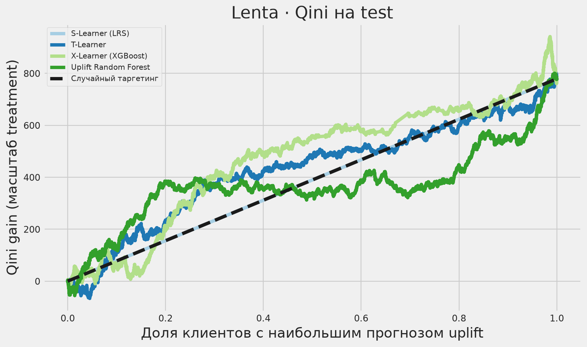
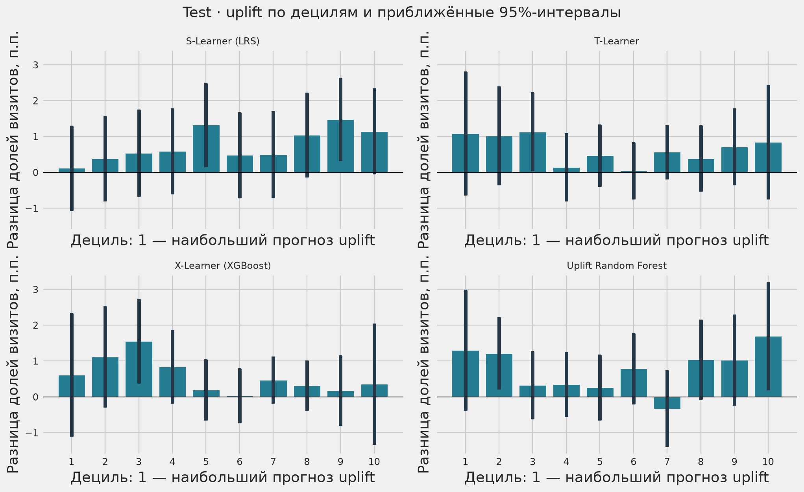
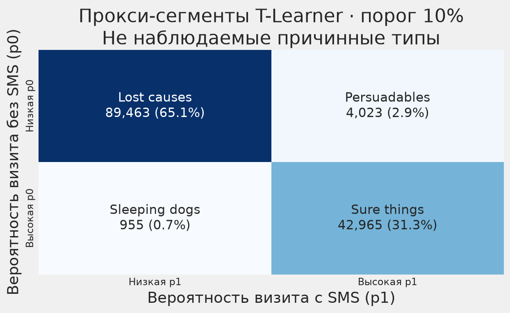
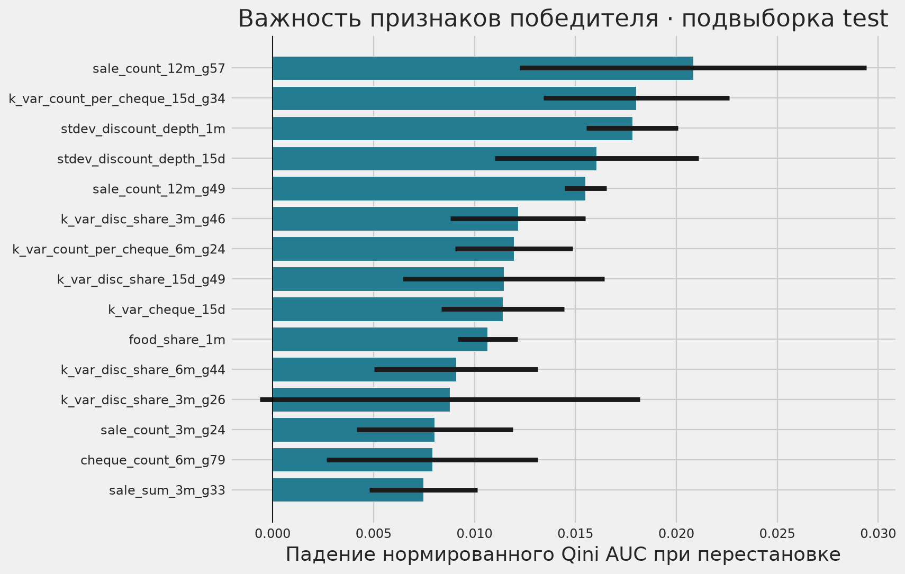

# Результаты полного запуска Lenta

687 029 клиентов; train: 549 623, test: 137 406. Все метрики рассчитаны на test.

[Сравнение моделей](metrics.csv) · [Бизнес-отчёт](report.md) · [Экономические оценки](business.json)

Здесь опубликованы агрегированные результаты. Индивидуальные прогнозы, списки строк
train/test и сериализованный препроцессор создаются локально при запуске пайплайна
и не включены в публичный репозиторий.

## Qini-кривые

## Uplift по децилям

## Условные сегменты

Это модельная иллюстрация по вероятностям T-Learner, а не наблюдаемые причинные типы клиентов.

## Важность признаков

Перестановочная важность победителя на подвыборке test.

